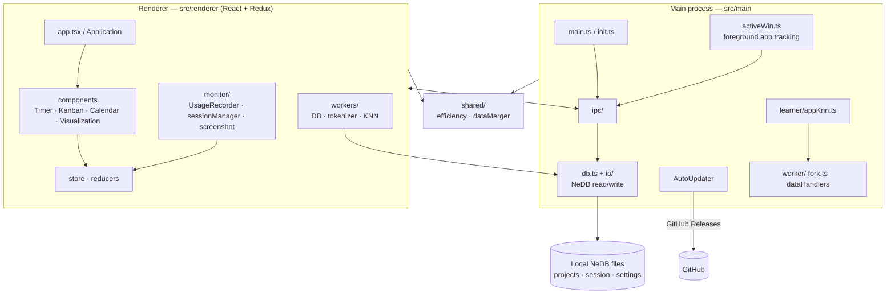

# Architecture

An Electron desktop app (macOS, Apple Silicon): Pomodoro timer + Kanban board + calendar, with local activity tracking.

```mermaid
flowchart TD
    subgraph Main["Main process — src/main"]
        MainTS[main.ts / init.ts]
        IPC[ipc/]
        AW[activeWin.ts<br/>foreground app tracking]
        DB[db.ts + io/<br/>NeDB read/write]
        UPD[AutoUpdater]
        Learner[learner/appKnn.ts]
        Wk[worker/ fork.ts · dataHandlers]
    end

    subgraph Renderer["Renderer — src/renderer (React + Redux)"]
        App[app.tsx / Application]
        Store[store · reducers]
        Comp[components<br/>Timer · Kanban · Calendar · Visualization]
        Mon[monitor/<br/>UsageRecorder · sessionManager · screenshot]
        WW["workers/<br/>DB · tokenizer · KNN"]
    end

    Shared[shared/<br/>efficiency · dataMerger]
    Files[(Local NeDB files<br/>projects · session · settings)]

    Comp --> Store
    App --> Comp
    Mon --> Store
    Renderer <-->|IPC| IPC
    MainTS --> IPC
    AW --> IPC
    IPC --> DB --> Files
    WW --> DB
    Learner --> Wk
    Renderer --> Shared
    Main --> Shared
    UPD -->|GitHub Releases| GH[(GitHub)]
```

All data stays on-device.
